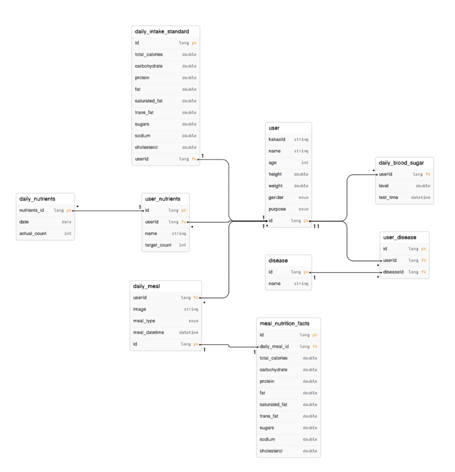

# today-it-backend

---
## Entity (domain)
### ERD

- User : 회원 정보를 저장하는 테이블
- DailyIntakeStandard : 섭취해야하는 총 칼로리와 영양소량을 저장한 테이블
- Disease : 질병 종류를 저장하는 테이블

- UserDisease : 회원별 지병을 저장하는 테이블
- UserSupplement : 사용자가 설정한 영양제 섭취량을 기록한 테이블

- DailyMeal : 식사별로 섭취한 칼로리와 영양소량을 저장한 테이블
- MealNutritionFacts : 기록된 식사별 영양정보 분석한 테이블
- DailySupplement : 일별 사용자의 영양제 섭취량을 저장한 테이블
- DailyBloodSugar : 일별 사용자의 혈당 수치와 체크 시간을 기록한 테이블

